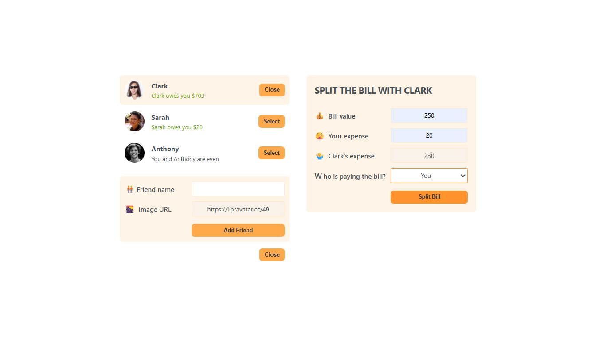

# Eat-'N-Split

Practice project from course of Jonas Schmedtmann (Udemy)

### What is this?

This project is a React application called "Eat-'N-Split" for tracking shared expenses with friends. You can add friends, select a friend, and split bills, with the app calculating who owes whom and by how much.

### Stack

- React (v19) — for building the user interface
- Vite — as the build tool and development server
- Vitest — for unit testing
- @testing-library/react — for testing React components
- ESLint — for code linting
- PropTypes — for runtime prop type checking
- jsdom — for simulating the DOM in tests

### How to get started

To start the app, run the following command in your project directory:

```sh
npm run dev
```

This will launch the Vite development server.
You can then open http://localhost:3000 in your browser to view the app.

### Testing

The project is configured for testing with Vitest and @testing-library/react. While there are currently no comprehensive tests, the setup is ready for adding and running tests.

### What did you study/practice/experiment with?

#### 1.Component-Based Architecture (React):

    - How to break down the UI into reusable, logical components (organisms, atoms, etc.).
    - Managing state and props to facilitate communication between components.

#### 2.State Management:

    - Using React’s useState hook for local component state.
    - Implementing custom hooks like useNewFriend to encapsulate and reuse complex logic.

#### 3.Event Handling and User Interaction:

    - Handling user actions (clicks, form submissions, selections) and updating the UI accordingly.
    - Passing callback functions as props to child components.

#### 4.Conditional Rendering:

    - Displaying components conditionally (e.g., showing forms only when needed).

#### 5.Forms Handling:

    - Managing form inputs, validation, and processing submit events.

#### 6.Data Flow:

    - Lifting state up to parent components to share data between siblings.
    - Passing data and functions down via props.

#### 7.Component Styling and Layout:

    - Organizing the application layout (sidebar, main area).
    - Applying styles with class names.

#### 8.Project Organization:

    - Structuring files by feature or domain (@organisms, @atoms, @utils, etc.).
    - Importing and using components from different folders.

#### 9.React Best Practices:

    - Using keys for dynamic lists/components.
    - Keeping components focused and maintainable.

### Demo


